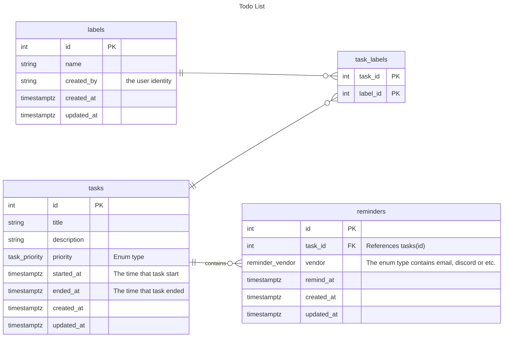

```mermaid
---
title: Todo List
---
erDiagram
    direction LR
    tasks ||--o{ task_labels : ""
    labels ||--o{ task_labels : ""
    tasks ||--o{ reminders: contains
    
    tasks { 
        int id PK
        string title
        string description
        task_priority priority "Enum type"
        timestamptz started_at "The time that task start"
        timestamptz ended_at "The time that task ended"
        timestamptz created_at
        timestamptz updated_at
    }

    labels {
        int id PK
        string name
        string created_by "the user identity"
        timestamptz created_at
        timestamptz updated_at
    }
    
    task_labels {
         int task_id PK
         int label_id PK
    }

    reminders {
        int id PK
        int task_id FK "References tasks(id)"
        reminder_vendor vendor "The enum type contains email, discord or etc."
        timestamptz remind_at
        timestamptz created_at
        timestamptz updated_at
    }

```