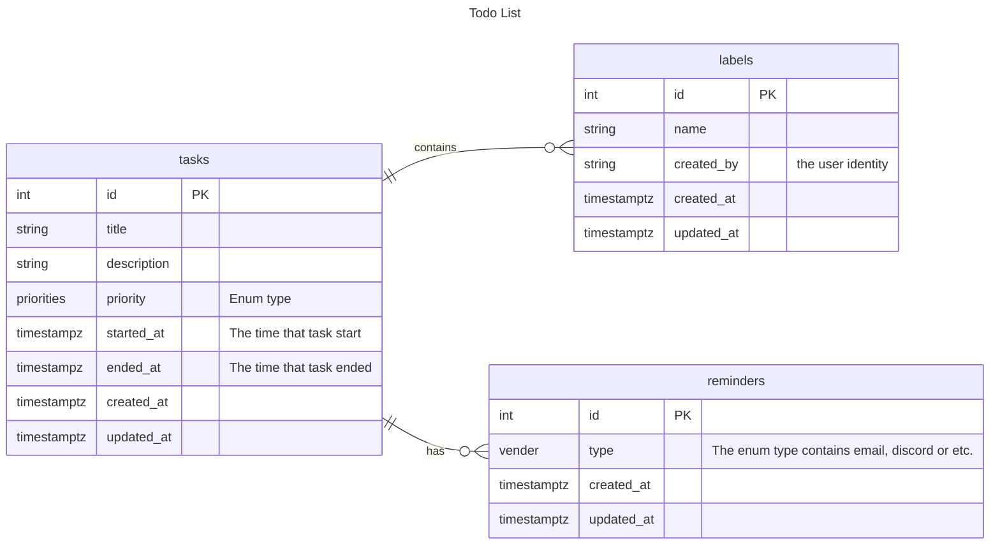

```mermaid
---
title: Todo List
---
erDiagram
    direction LR
    tasks ||--o{ labels : contains
    tasks ||--o{  reminders: has
    
    tasks { 
        int id PK
        string title
        string description
        priorities priority "Enum type"
        timestampz started_at "The time that task start"
        timestampz ended_at "The time that task ended"
        timestamptz created_at
        timestamptz updated_at
    }

    labels {
        int id PK
        string name
        string created_by "the user identity"
        timestamptz created_at
        timestamptz updated_at
    }
    
    reminders {
        int id PK
        vender type "The enum type contains email, discord or etc."
        timestamptz created_at
        timestamptz updated_at
    }


```